# AI Guardian Web Shield

AI Guardian Web Shield is a privacy-first browser security assistant that analyzes webpages, links, and search results locally to provide calm, plain-language risk guidance.

The extension helps users recognize potentially risky situations such as phishing attempts, suspicious links, misleading domains, and manipulative page behaviors while maintaining a strong commitment to privacy and accessibility.

AI Guardian Web Shield follows a local-first design philosophy, meaning analysis occurs on the user’s device whenever possible, reducing reliance on external data collection.

Risk scores are intended to provide guidance and awareness. They do not guarantee that a page is safe or unsafe.

---

# AI Guardian Web Shield is designed around three principles:

Calm security
Security tools should reduce anxiety, not increase it.

Local privacy
Browsing data should remain on the user's device whenever possible.

Human clarity
Security signals should be understandable without technical expertise.

---

# Screenshots

## Real-time risk scoring on webpages
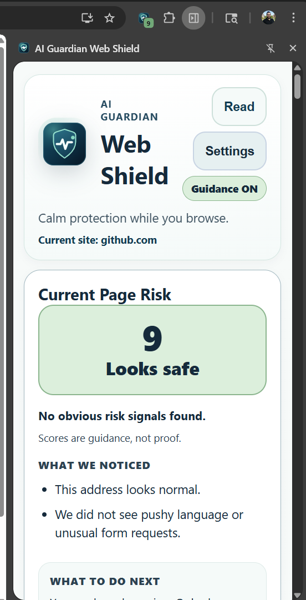

## Floating safety indicator for quick awareness
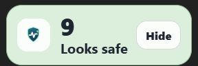

## Google search results with risk signals
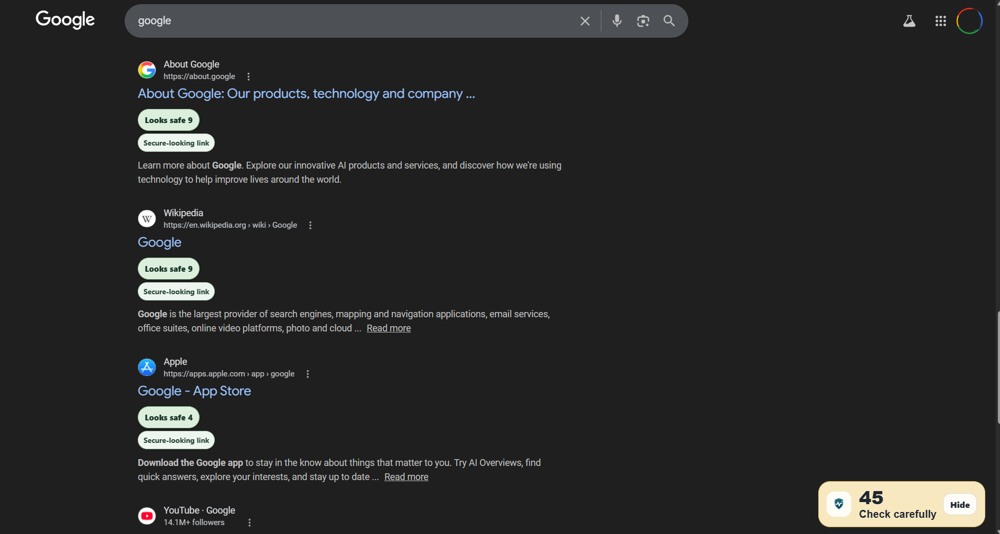

## Site identity and trust signals
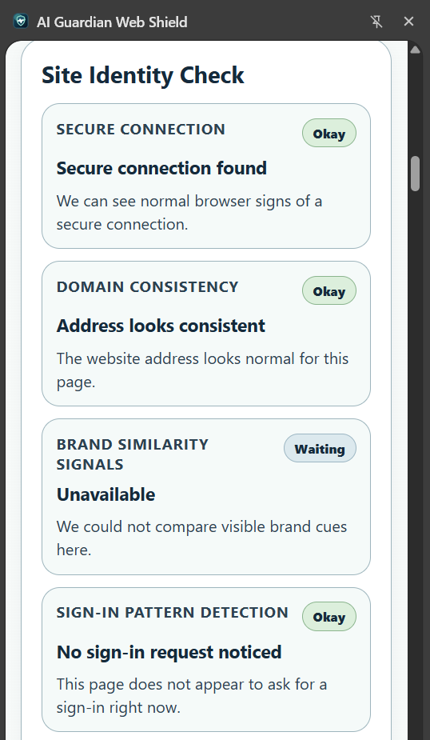

## Email safety preview detection
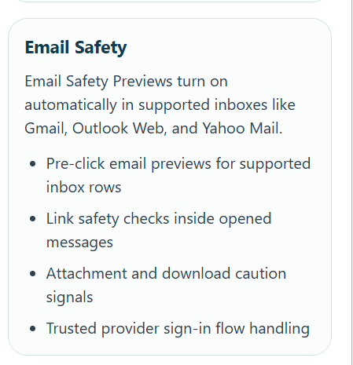

## Email risk warning example
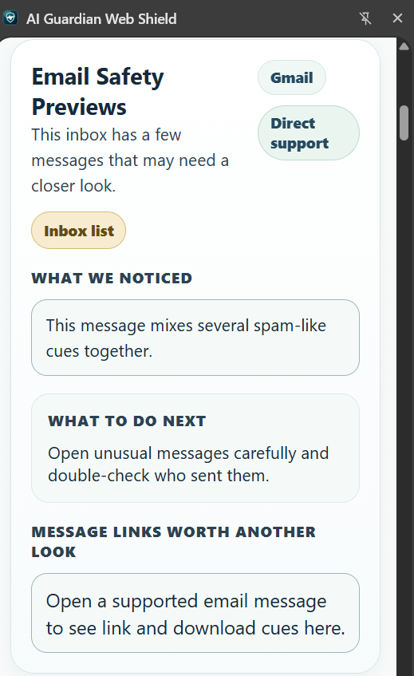

## Email message detail signals
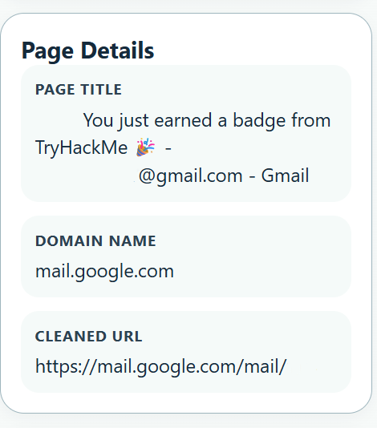

## Extension installed confirmation
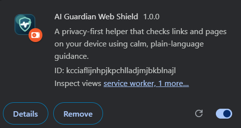

## Action tools panel
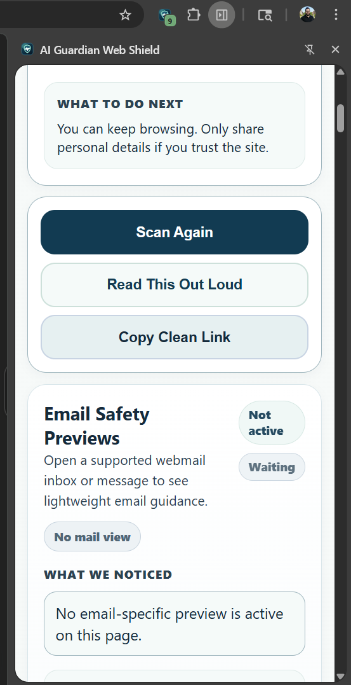

## Family protection controls
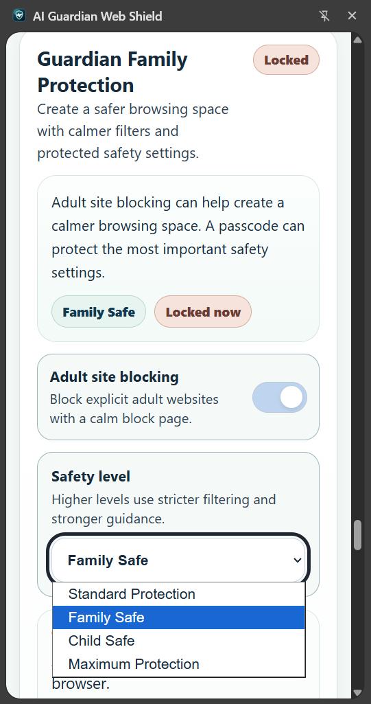

## Protected settings lock
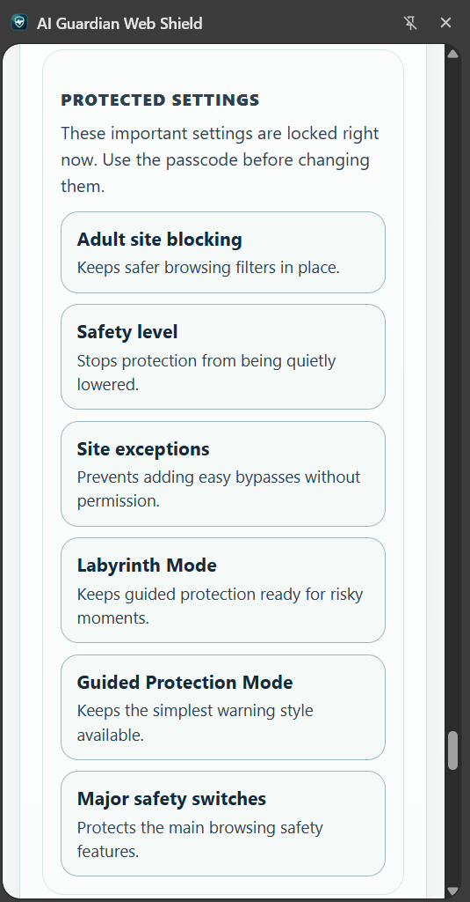

## Trusted adult review history
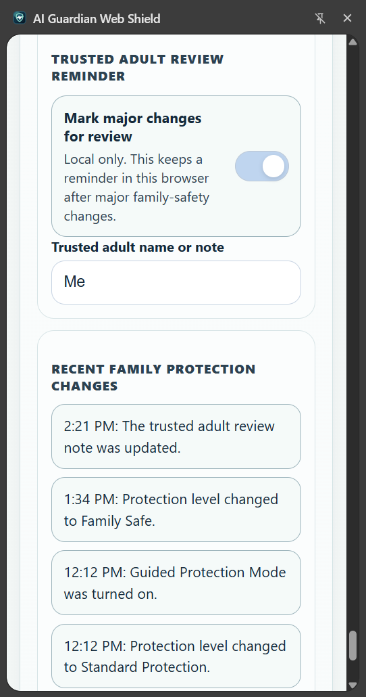

## Accessibility reading profiles
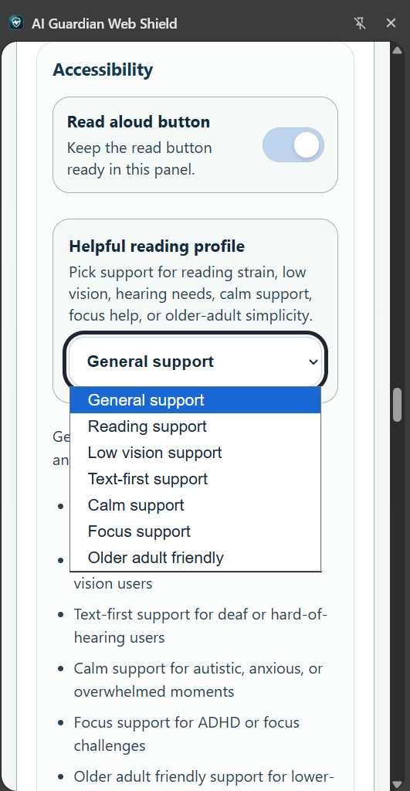

## Accessibility visual support settings
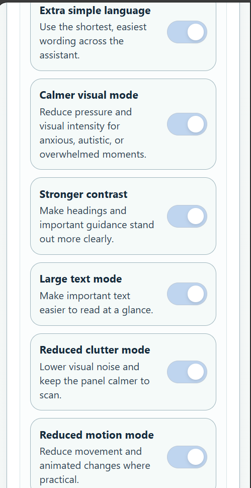

## Settings controls panel
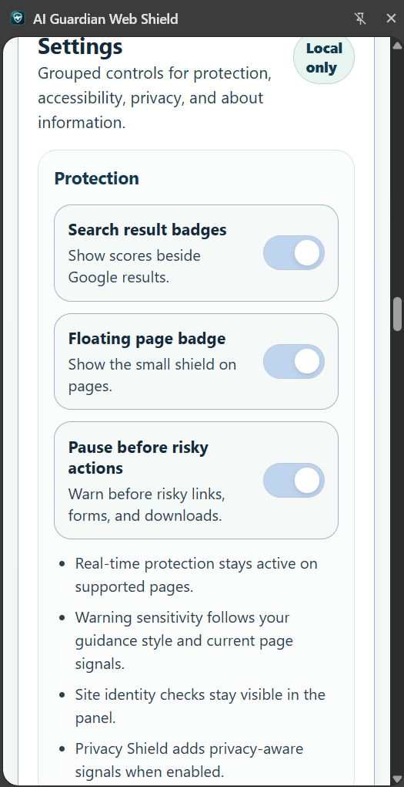

## Labyrinth Guardian slowdown protection
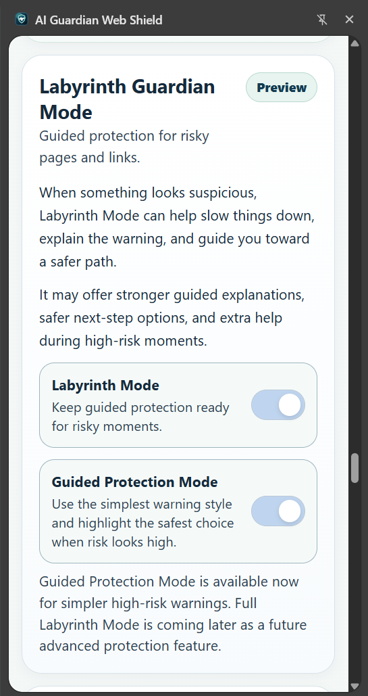

## Labyrinth protection style options
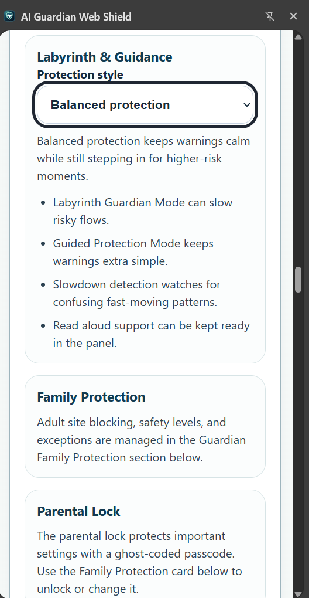

## Labyrinth protection dropdown
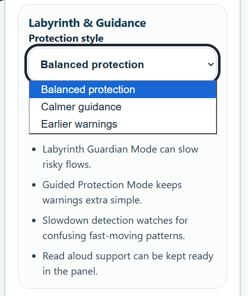

## AI Guardian Privacy Shield concept
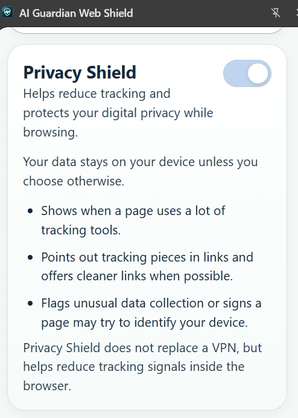

## Guardian ethics principles
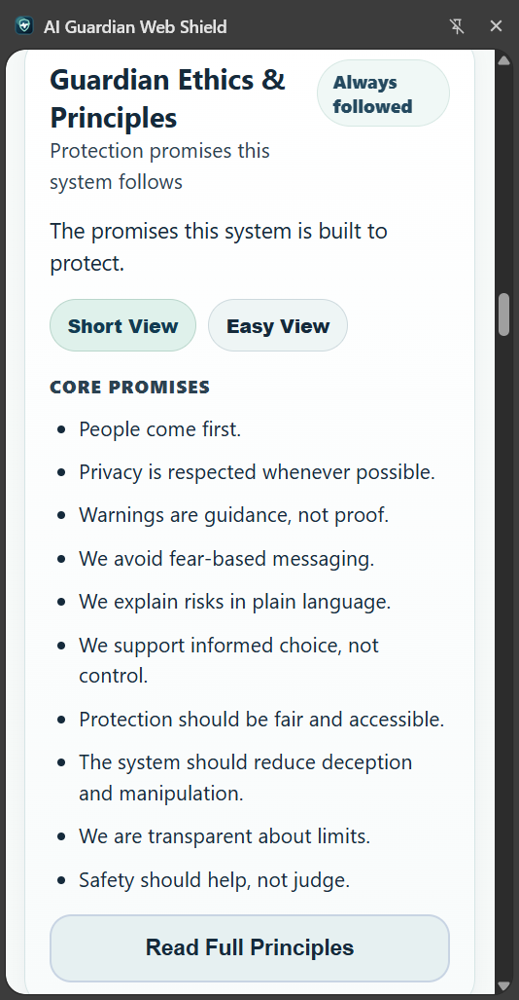

---

# Key Features

## Real-time risk awareness
AI Guardian Web Shield continuously evaluates pages and links using locally available signals and provides a simple risk score from 0–100.

Risk scoring helps users interpret situations such as:

• suspicious links  
• misleading domain names  
• potential phishing indicators  
• unusual page structures  
• risky download prompts  
• unexpected login requests  
• manipulative urgency language  

---

## Search result safety indicators
Google search results display score badges next to links to help users identify potentially risky destinations before clicking.

Badges provide early awareness of:

• suspicious domain structures  
• shortened or obfuscated URLs  
• unusual link patterns  
• high-risk page signals  

---

## Floating page safety indicator
Each supported page displays a small floating score badge for continuous awareness.

The floating badge:

• updates dynamically as page signals change  
• can be hidden for reduced visual clutter  
• opens detailed explanations when clicked  

---

## Site Identity Check
The popup includes a Site Identity Check panel that explains browser-visible trust signals such as:

• secure connection indicators (HTTPS presence)  
• domain consistency signals  
• login pattern observations  
• brand similarity cues when detectable  

This helps users interpret website trust signals without requiring technical knowledge.

---

## Email safety preview signals
The extension can highlight potentially suspicious messages in supported webmail environments.

Signals may include:

• unusual link patterns  
• suspicious formatting cues  
• mixed trust indicators  
• potential phishing characteristics  

---

## Labyrinth Guardian mode
Labyrinth Guardian introduces protective friction when browsing patterns suggest elevated risk.

Examples include:

• rapid navigation between risky pages  
• repeated exposure to suspicious links  
• high-risk interaction patterns  

Labyrinth Guardian may slow certain actions and provide additional context to support safer decisions.

---

## Privacy Shield design concept
The Privacy Shield concept focuses on reducing unnecessary tracking exposure within the browser by identifying:

• tracking-heavy link structures  
• excessive URL parameters  
• suspicious redirect patterns  

Privacy Shield is not a replacement for VPNs or network-layer tools but helps increase awareness of visible tracking signals.

---

## Guardian Family Protection
Guardian Family Protection introduces optional safety controls designed to support safer browsing environments.

Features include:

• adult site blocking using local signal combinations  
• adjustable safety levels  
• site exceptions  
• change history tracking  
• passcode protection for important settings  

The design aims to balance safety with access to legitimate educational, medical, legal, and support resources.

---

## Accessibility-first design
AI Guardian Web Shield includes multiple accessibility support options designed to reduce cognitive load and improve readability.

Available supports include:

• reading support profiles  
• reduced visual clutter mode  
• calmer visual presentation  
• strong contrast mode  
• large text mode  
• reduced motion mode  
• read-aloud capability  
• simplified language presentation  

These features aim to support users with:

• reading strain  
• ADHD  
• dyslexia  
• dysgraphia  
• low vision  
• anxiety  
• cognitive fatigue  

---

# Risk Score Labels

| Score | Guidance |
|------|----------|
| 0–19 | Looks safe |
| 20–39 | Low caution |
| 40–59 | Be careful |
| 60–79 | High caution |
| 80–100 | High risk |

Scores are informational guidance only.

Users should still apply independent judgment.

---

# Local-first security approach

AI Guardian Web Shield uses browser-visible signals and local analysis whenever possible.

Example signals include:

• domain structure characteristics  
• link length and complexity  
• shortened URL patterns  
• lookalike domain signals  
• presence of HTTPS indicators  
• form fields requesting credentials or sensitive information  
• suspicious download indicators  
• urgency or pressure language patterns  
• link tracking parameters  
• inconsistent page identity signals  

No browsing content is transmitted to external servers by default.

---

# Project structure

manifest.json  
Chrome extension configuration and permissions.

background.js  
Maintains tab state, manages risk updates, protects family settings, and tracks rapid interaction signals.

content.js  
Performs page signal evaluation, renders floating indicator, detects risky patterns, and provides proactive warnings.

popup.html  
User interface layout.

popup.css  
Visual styling and accessibility adjustments.

popup.js  
Renders risk explanations, settings controls, accessibility tools, and guidance details.

icons/  
Extension icon assets.

images/  
Project documentation screenshots.

scripts/generate-icons.ps1  
PowerShell script for regenerating icon assets.

---

# Installation (Developer Mode)

1. Open Chrome
2. Navigate to:

chrome://extensions

3. Enable Developer Mode
4. Select Load unpacked
5. Choose the ai-guardian-web-shield folder
6. Visit a website or perform a Google search
7. The floating safety badge and popup guidance will appear

---

# Privacy considerations

AI Guardian Web Shield is designed to minimize data exposure.

Key principles:

• analysis occurs locally whenever possible  
• page content is not transmitted externally by default  
• minimal permissions are requested  
• guidance is informational, not authoritative  
• the extension does not replace antivirus software  
• the extension does not replace network-layer security tools  
• family protection operates locally in this version  
• trusted adult reminders are local-only in this version  
• browser extensions cannot guarantee full protection if a device is already compromised  

---

# Intended use

AI Guardian Web Shield is designed for:

• general users seeking clearer security signals  
• families supporting safer browsing habits  
• accessibility-aware browsing environments  
• cybersecurity awareness demonstrations  
• portfolio demonstration of defensive security design concepts  

---

# Relationship to Project Labyrinth

AI Guardian Web Shield complements Project Labyrinth by demonstrating applied defensive security design concepts in a browser environment.

Conceptual connections include:

• zero trust inspired evaluation  
• behavioral risk awareness  
• human-centered security guidance  
• privacy-first architecture thinking  

---
## Possible future improvements

- optional threat intelligence enrichment
- expanded phishing pattern detection
- improved brand impersonation similarity checks
- accessibility personalization profiles
- enterprise policy integration options
- optional encrypted sync of user preferences
- research testing for slowdown-based risk detection UX
---

# License

MIT License
